# 🏗️ UML Diagrams - AI RAG Microservice & Backend

## 📋 Table of Contents
- [AI RAG Microservice UML Diagrams](#-ai-rag-microservice-uml-diagrams)
- [Backend UML Diagrams](#-backend-uml-diagrams)
- [Integration UML Diagrams](#-integration-uml-diagrams)
- [Deployment Diagrams](#-deployment-diagrams)

---

## 🤖 AI RAG Microservice UML Diagrams

### **1. Class Diagram - AI RAG Microservice**

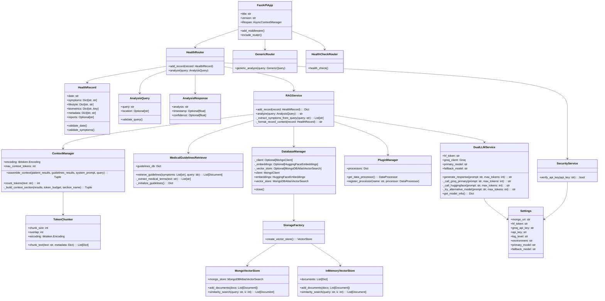

### **2. Sequence Diagram - RAG Analysis Flow**

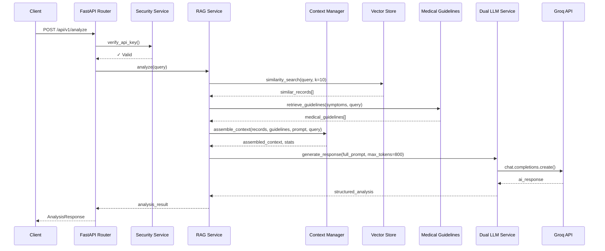

### **3. Component Diagram - AI RAG Architecture**

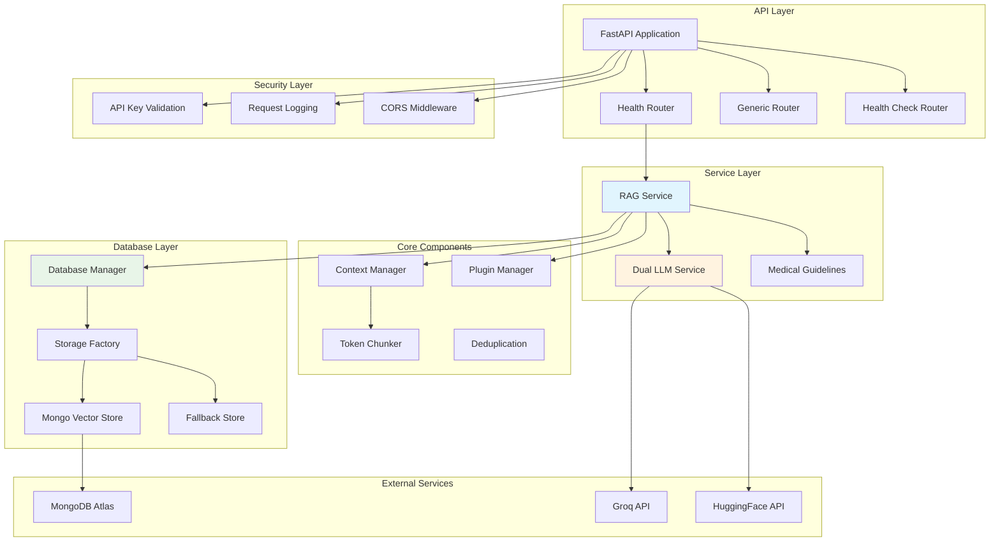

---

## 🏥 Backend UML Diagrams

### **1. Class Diagram - Backend System**

```mermaid
classDiagram
    %% Express Application
    class ExpressApp {
        +app: Express
        +cors: CorsOptions
        +routes: Router
        +errorHandler: ErrorHandler
        +notFoundHandler: NotFoundHandler
    }

    %% Controllers
    class AuthController {
        +login(req: Request, res: Response): Promise~void~
        +register(req: Request, res: Response): Promise~void~
        +refreshToken(req: Request, res: Response): Promise~void~
    }

    class HealthRecordController {
        +createRecord(req: Request, res: Response): Promise~void~
        +getRecords(req: Request, res: Response): Promise~void~
        +getRecord(req: Request, res: Response): Promise~void~
        +getAnalysis(req: Request, res: Response): Promise~void~
    }

    %% Services
    class AuthService {
        +login(email: string, password: string): Promise~AuthResult~
        +register(userData: RegisterDto): Promise~User~
        +generateTokens(user: User): TokenPair
        +verifyToken(token: string): AuthTokenPayload
    }

    class HealthRecordService {
        +createRecord(userId: number, recordData: CreateHealthRecordDto): Promise~HealthRecord~
        +getUserRecords(userId: number, limit?: number): Promise~HealthRecord[]~
        +getRecordById(recordId: number, userId: number): Promise~HealthRecord~
        +updateRecordAnalysis(recordId: number, analysis: any): Promise~void~
    }

    class AIService {
        -AI_SERVICE_URL: string
        +analyzeHealthRecord(healthRecord: HealthRecord): Promise~HealthAnalysis~
        -fallbackAnalysis(record: HealthRecord): HealthAnalysis
        -extractFromAnalysis(analysis: string, keyword: string, record: HealthRecord): string[]
        -fallbackSymptomPattern(record: HealthRecord): string[]
        -fallbackRiskFactors(record: HealthRecord): string[]
        -fallbackRecommendations(record: HealthRecord): string[]
    }

    class AnalysisService {
        +analyzeHealthRecord(healthRecord: HealthRecord): Promise~HealthAnalysis~
    }

    %% Models
    class UserModel {
        +findByEmail(email: string): Promise~User | null~
        +create(userData: RegisterDto): Promise~User~
        +findById(id: number): Promise~User | null~
    }

    class HealthRecordModel {
        +create(userId: number, recordData: CreateHealthRecordDto): Promise~HealthRecord~
        +findByUserId(userId: number, limit?: number): Promise~HealthRecord[]~
        +findById(recordId: number, userId: number): Promise~HealthRecord | null~
        +updateAnalysis(recordId: number, analysis: any): Promise~void~
    }

    %% Types/Interfaces
    class User {
        +id: number
        +email: string
        +password: string
        +created_at: Date
    }

    class HealthRecord {
        +id: number
        +user_id: number
        +record_date: string
        +record_time: string
        +site?: string
        +onset?: string
        +character?: string
        +severity?: number
        +symptoms?: string
        +medications?: string
        +vital_signs?: VitalSigns
        +ai_analysis?: any
        +created_at: Date
        +updated_at: Date
    }

    class VitalSigns {
        +blood_pressure?: string
        +temperature?: string
        +pulse?: string
        +weight?: string
    }

    class HealthAnalysis {
        +recordId: number
        +analysisDate: string
        +symptomSeverity: string | number
        +symptomPattern: string[]
        +riskFactors: string[]
        +recommendations: string[]
        +trends: TrendData
        +redFlags: string[]
    }

    class CreateHealthRecordDto {
        +record_date: string
        +record_time: string
        +symptoms?: string
        +severity?: number
        +medications?: string
        +vital_signs?: VitalSigns
    }

    %% Middleware
    class AuthMiddleware {
        +authMiddleware(req: Request, res: Response, next: NextFunction): void
        +verifyToken(token: string): AuthTokenPayload
    }

    class ValidationMiddleware {
        +validateRequest(schema: Joi.Schema): RequestHandler
        +healthRecordSchema: Joi.Schema
    }

    class ErrorHandler {
        +errorHandler(err: Error, req: Request, res: Response, next: NextFunction): void
        +notFoundHandler(req: Request, res: Response): void
        +asyncHandler(fn: Function): RequestHandler
    }

    %% Database
    class DatabaseConfig {
        +pool: Pool
        +query(text: string, params?: any[]): Promise~QueryResult~
        +getClient(): Promise~PoolClient~
    }

    %% Relationships
    ExpressApp --> AuthController
    ExpressApp --> HealthRecordController
    ExpressApp --> AuthMiddleware
    ExpressApp --> ValidationMiddleware
    ExpressApp --> ErrorHandler

    AuthController --> AuthService
    HealthRecordController --> HealthRecordService
    HealthRecordController --> AnalysisService

    AnalysisService --> AIService
    AuthService --> UserModel
    HealthRecordService --> HealthRecordModel

    UserModel --> DatabaseConfig
    HealthRecordModel --> DatabaseConfig

    HealthRecord --> VitalSigns
    AIService --> HealthAnalysis
    HealthRecordController --> CreateHealthRecordDto

    AuthMiddleware --> AuthService
    ValidationMiddleware --> CreateHealthRecordDto
```

### **2. Sequence Diagram - Health Record Creation & Analysis**

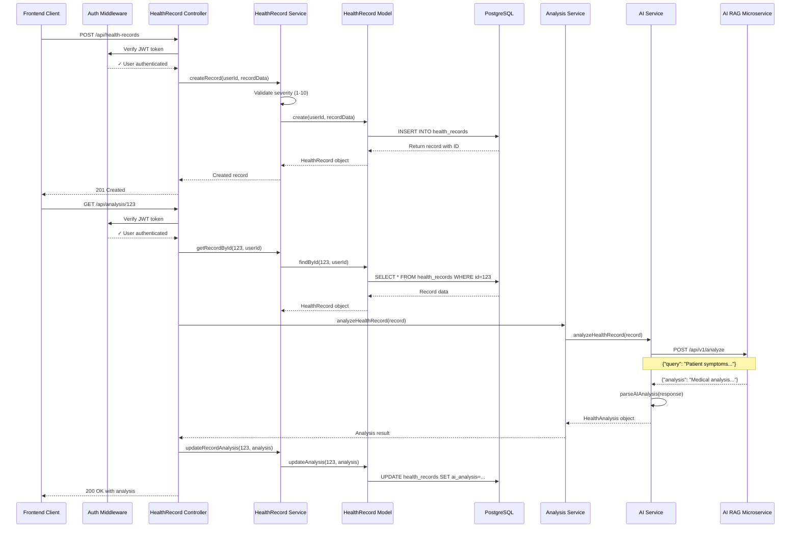

### **3. Component Diagram - Backend Architecture**

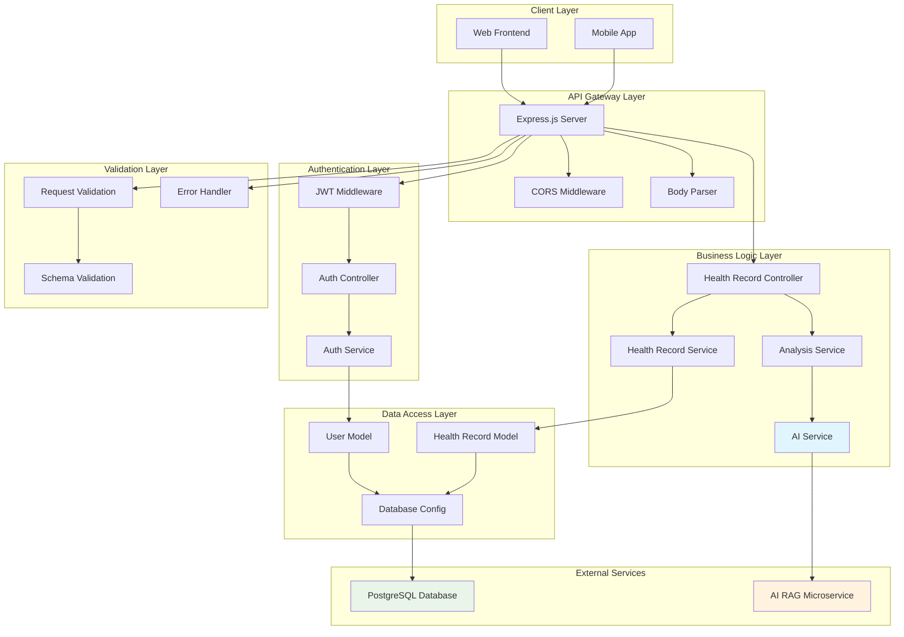

---

## 🔗 Integration UML Diagrams

### **1. System Integration Overview**

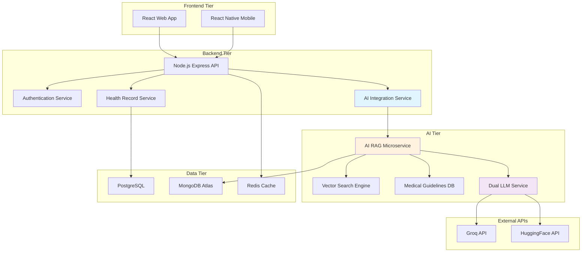

### **2. Data Flow Integration Diagram**

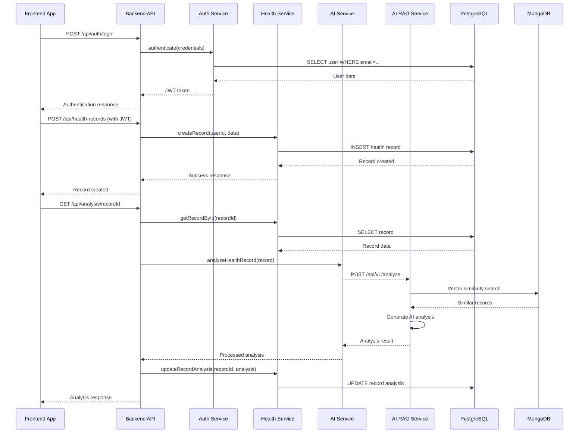

---

## 🚀 Deployment Diagrams

### **1. Development Environment**

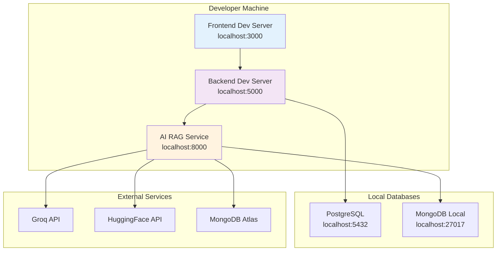

### **2. Production Deployment**

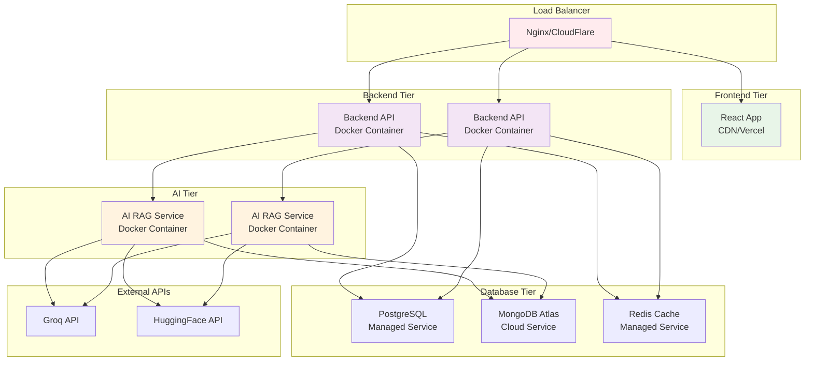

### **3. Container Architecture**

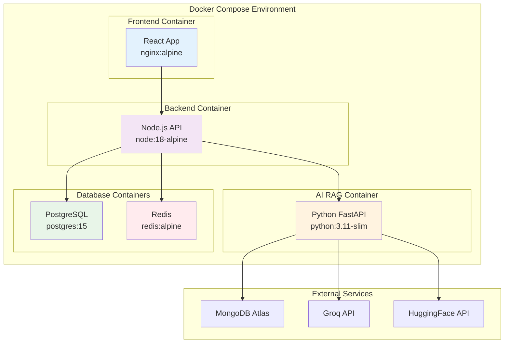

---

## 🎯 Key UML Insights

### **AI RAG Microservice:**
- **Layered Architecture**: Clear separation between API, Service, and Data layers
- **Plugin System**: Extensible design with plugin manager
- **Fallback Mechanisms**: Multiple fallback strategies for reliability
- **Vector Processing**: Sophisticated chunking and embedding pipeline

### **Backend System:**
- **MVC Pattern**: Controllers, Services, and Models clearly separated
- **Middleware Pipeline**: Authentication, validation, and error handling
- **Service Integration**: Clean integration with AI RAG microservice
- **Database Abstraction**: Proper data access layer

### **Integration Architecture:**
- **Microservice Communication**: HTTP-based API communication
- **Data Consistency**: Separate databases with eventual consistency
- **Scalability**: Independent scaling of services
- **Fault Tolerance**: Graceful degradation and fallback mechanisms

These UML diagrams provide a comprehensive view of both systems' architecture, their interactions, and deployment strategies.